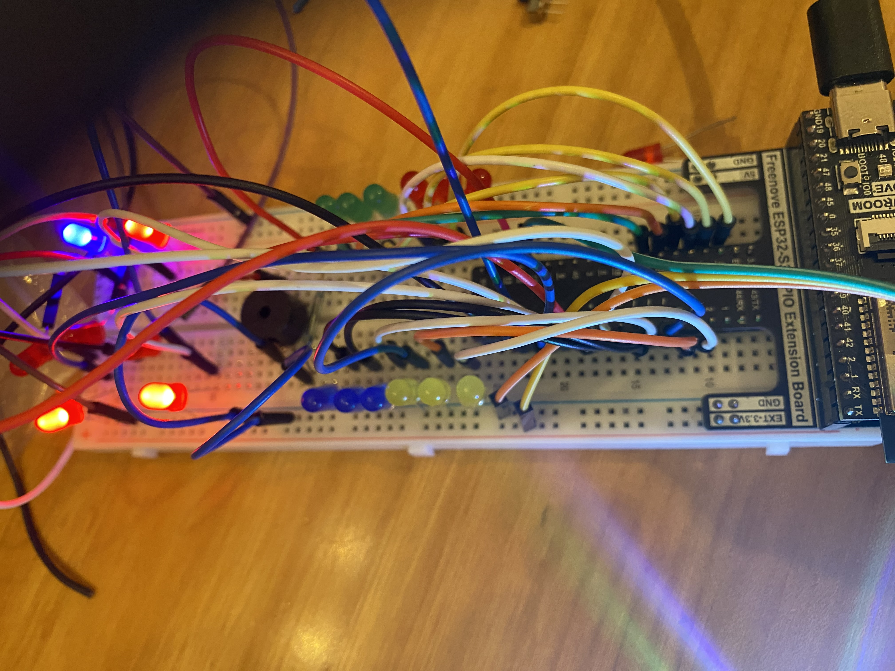
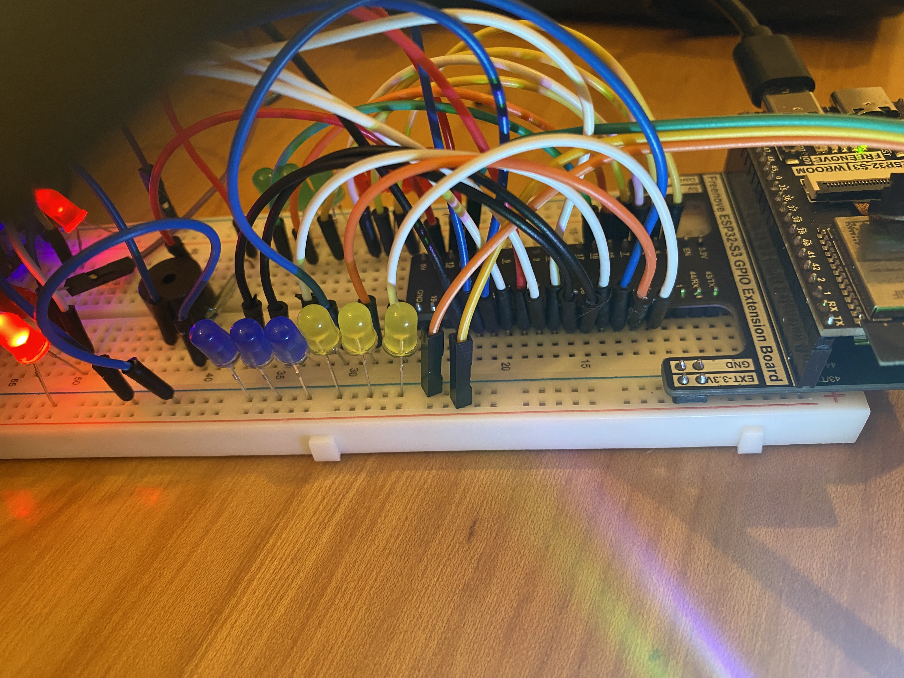
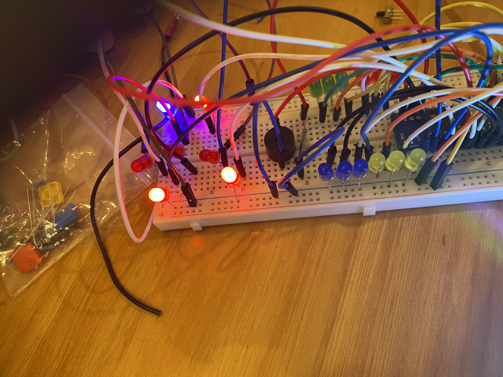
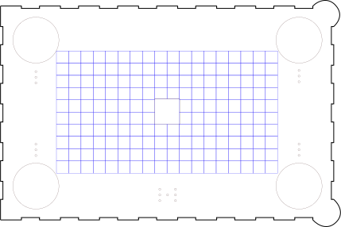

# VESM1VS05AU-Timaverkefni-7

<h2>Leikreglur</h2>

1. Það eru fjórir leikmenn með lituðum LED hnöppum (rauður, bláir, grænir, gulir).

2. Leikmenn skiptast á; þeir ýta á hnappinn sinn þegar hann kviknar til að kasta teningi með 7 LED og fá tölu frá 1-6.

3. Þú færir þig í gegnum reitina/gridið með leikmann þinn samkvæmt tölu sem þú fékkst í teningakasti, þú getur hreyft þig niður, til vinstri eða til hægri (engin hreyfing til hliðar).

4. Markmið: Náðu miðju borðsins, snertu einn af reitunum í kringum RGB LED til að verða King of the Hill (KOTH).

5. KOTH staða: Ef þú nærð KOTH þá kviknast á 1 ljósdíóða spilarans og RGB led í miðjunni með þínum lit.

6. Þú heldur KOTH í 3 umferðir til að vinna; allar þrjár ljósdídurnar í lit spilarans verða að loga.

7. Ef þú vinnur spilar Sigurtónn sig sjálfan.

8. Til að hrekja KOTH af völdum, verður þú að lenda á sama reit og KOTH er á, sem drepur hann. Þegar leikmaður/KOTH deyr fer hann aftur á reitinn fyrir framan LED hnappinn sinn.

# Prototýpa fyrir spilið án takka

# Mynd af spilið og lóðningu

# Inkscape Hönnunarteikning .svg

# Tengil á main.py

--> [main.py](Kodi/main.py)
